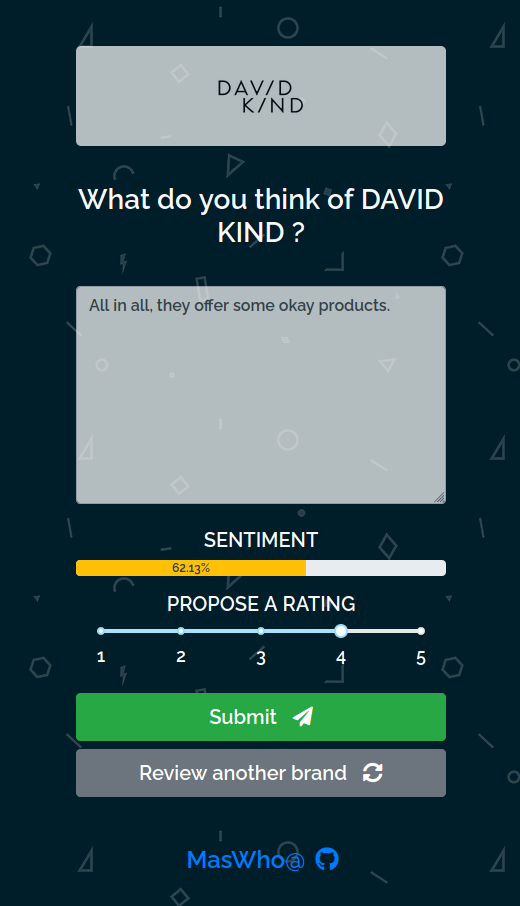

# Web-Sentiment-ML-Model-Deploy
A web-based application for predicting product review sentiment.

## Project Process:
 - Data collection - Web scraped product review data.
 - Model training - Implemented a Character-level CNN for predicting sentiment based on quantised text.
 - Building API - Implemented an Flask RESTful API integrating the trained model, a Postgres DB and a Dash front-end app.
 - Building front-end app - Implemented a front-end server using Plotly-Dash (A Python Dashboard package).
 - Docker - Implemented multiple docker containers wrapping the entire applciation stack using docker-compose.
 - AWS deployment - Hosted an EC2 instance on AWS, setup docker and deployed prebuild docker images. Acquired a custom domain name with SSL certificate installed. An ABL was setup to serve as a reverse proxy server to route traffic from HTTPS and HTTP to application port.

 

